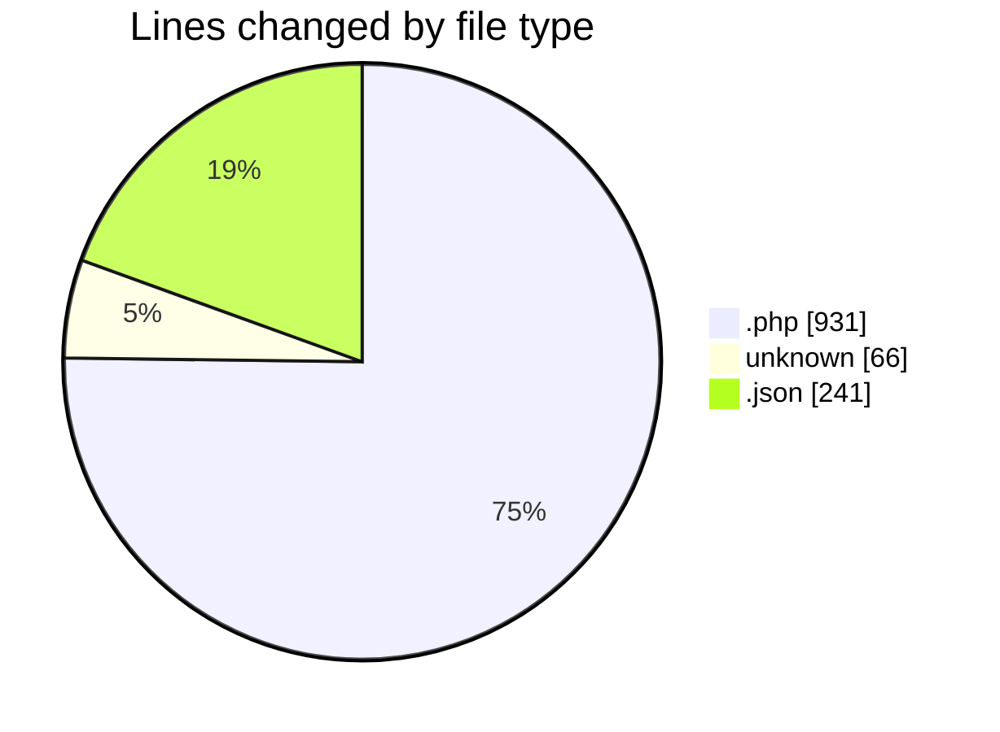
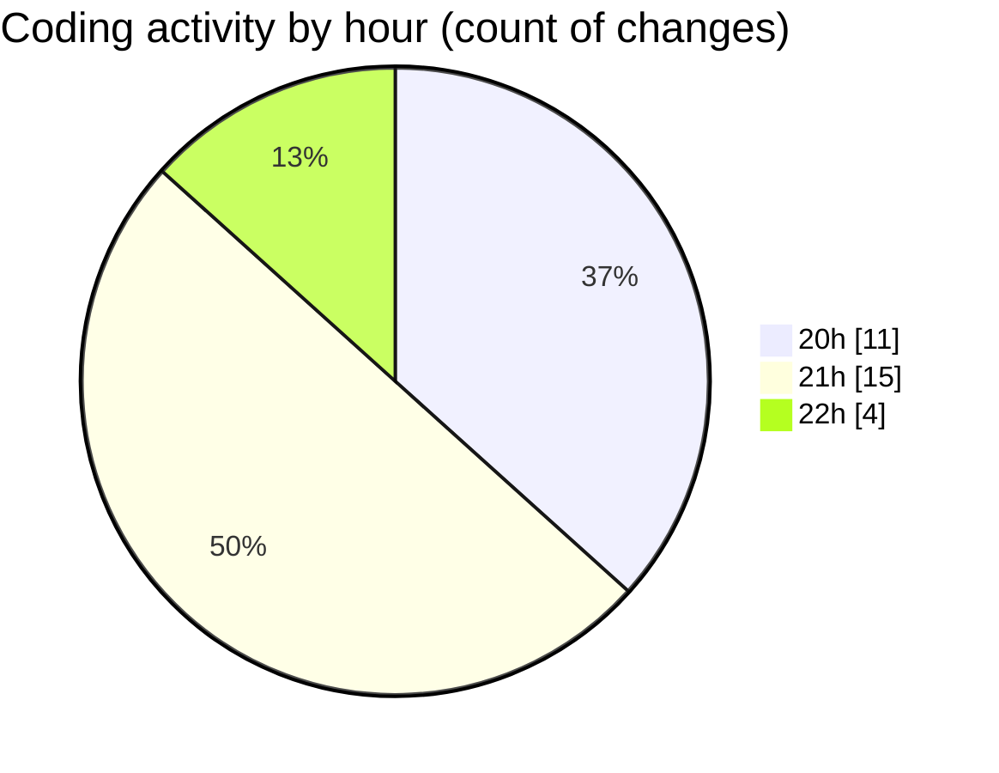

# test - Activity Summary 

## Overall Statistics

| Stat                   | Value                                                             |
| ---------------------- | ----------------------------------------------------------------- |
| **Lines Added** (➕)   | 1189                                          |
| **Lines Removed** (➖) | 49                                        |
| **Net Change** (↕)    | 1140                |
| **Active Time** (⌚)   | 47 minutes |

## Modified Files
- **DatabaseSeeder.php** (+25, -0)
- **2019_08_19_000000_create_failed_jobs_table.php** (+37, -0)
- **2022_04_04_144215_create_bookings_table.php** (+42, -1)
- **2022_04_04_143907_create_arenas_table.php** (+38, -0)
- **.env** (+66, -0)
- **settings.json** (+241, -0)
- **RoleSeedPivot.php** (+37, -0)
- **Arena.php** (+43, -1)
- **create.blade.php** (+127, -0)
- **index.blade.php** (+135, -0)
- **web.php** (+51, -0)
- **console.php** (+20, -0)
- **channels.php** (+19, -0)
- **api.php** (+20, -0)
- **booking.blade.php** (+96, -0)
- **home.blade.php** (+71, -47)
- **login.blade.php** (+121, -0)

## Visualizations

### By File Type (Lines Changed)

### By Hour (Estimated Activity Count)

> **Last Updated:** 4/10/2025, 10:07:33 PM