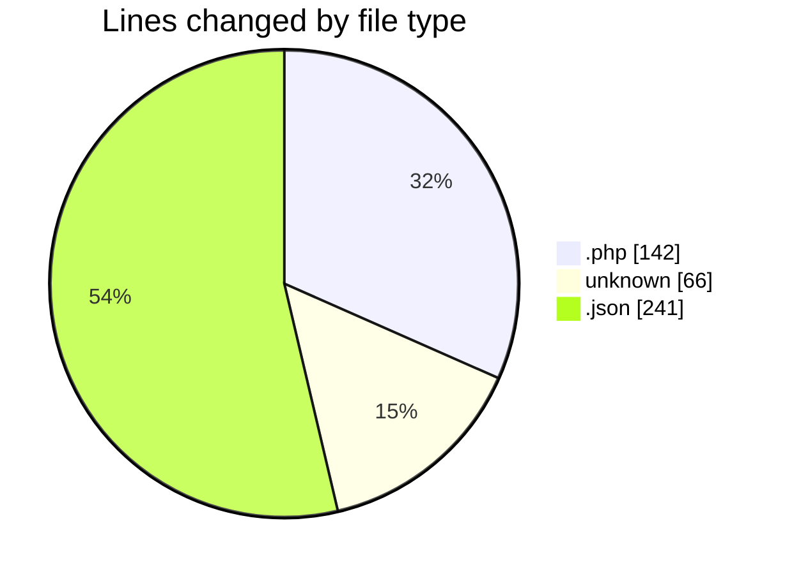
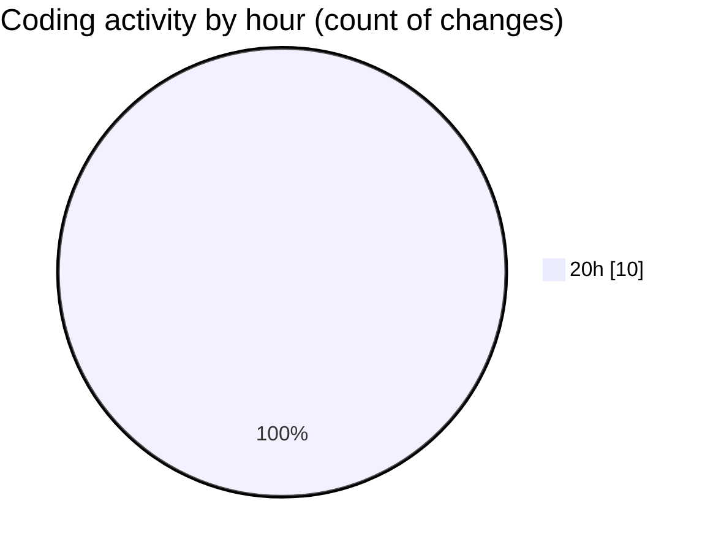

# test - Activity Summary 

## Overall Statistics

| Stat                   | Value                                                             |
| ---------------------- | ----------------------------------------------------------------- |
| **Lines Added** (➕)   | 448                                          |
| **Lines Removed** (➖) | 1                                        |
| **Net Change** (↕)    | 447                |
| **Active Time** (⌚)   | 11 minutes |

## Modified Files
- **DatabaseSeeder.php** (+25, -0)
- **2019_08_19_000000_create_failed_jobs_table.php** (+37, -0)
- **2022_04_04_144215_create_bookings_table.php** (+41, -1)
- **2022_04_04_143907_create_arenas_table.php** (+38, -0)
- **.env** (+66, -0)
- **settings.json** (+241, -0)

## Visualizations

### By File Type (Lines Changed)

### By Hour (Estimated Activity Count)

> **Last Updated:** 4/10/2025, 8:57:33 PM