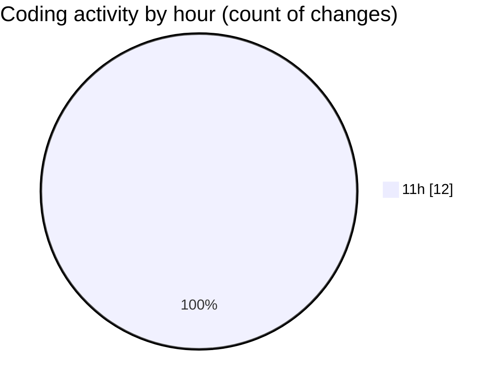

# belajar flutter - Activity Summary 

## Overall Statistics

| Stat                   | Value                                                             |
| ---------------------- | ----------------------------------------------------------------- |
| **Lines Added** (➕)   | 311                                          |
| **Lines Removed** (➖) | 15                                        |
| **Net Change** (↕)    | 296                |
| **Active Time** (⌚)   | 19 minutes |

## Modified Files
- **hello_word.dart** (+25, -0)
- **main.dart** (+32, -15)
- **column_widget.dart** (+20, -0)
- **settings.json** (+233, -0)
- **row_widget.dart** (+1, -0)

## Visualizations

### By File Type (Lines Changed)

### By Hour (Estimated Activity Count)

> **Last Updated:** 4/17/2025, 11:47:47 AM