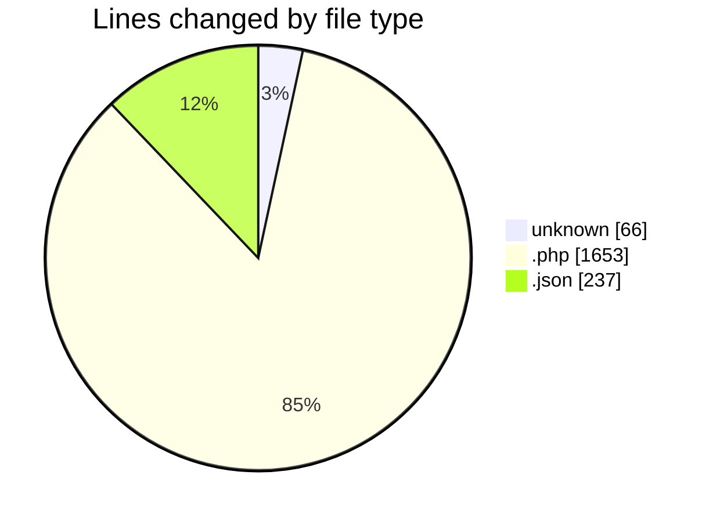
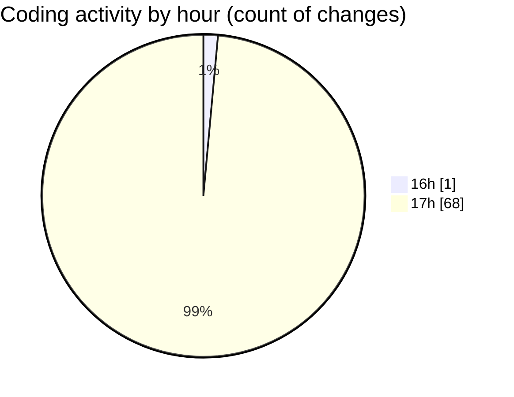

# studio-backend - Activity Summary 

## Overall Statistics

| Stat                   | Value                                                             |
| ---------------------- | ----------------------------------------------------------------- |
| **Lines Added** (➕)   | 1849                                          |
| **Lines Removed** (➖) | 107                                        |
| **Net Change** (↕)    | 1742                |
| **Active Time** (⌚)   | 82 minutes |

## Modified Files
- **.env** (+66, -0)
- **AuthController.php** (+106, -0)
- **RoomController.php** (+128, -0)
- **ProductController.php** (+252, -62)
- **BookingController.php** (+148, -0)
- **Room.php** (+33, -19)
- **2025_05_27_100637_create_rooms_table.php** (+31, -0)
- **2025_05_27_100715_create_products_table.php** (+31, -0)
- **2025_05_27_100731_create_bookings_table.php** (+33, -0)
- **0001_01_01_000000_create_users_table.php** (+50, -0)
- **Product.php** (+14, -0)
- **Booking.php** (+21, -0)
- **app.blade.php** (+115, -0)
- **sidebar.blade.php** (+15, -0)
- **topbar.blade.php** (+11, -0)
- **footer.blade.php** (+8, -0)
- **dashboard.blade.php** (+6, -0)
- **login.blade.php** (+92, -9)
- **register.blade.php** (+90, -7)
- **settings.json** (+237, -0)
- **web.php** (+31, -1)
- **DummyDataSeeder.php** (+55, -0)
- **DatabaseSeeder.php** (+24, -3)
- **index.blade.php** (+34, -6)
- **create.blade.php** (+17, -0)
- **edit.blade.php** (+18, -0)
- **index.blade.php** (+28, -0)
- **create.blade.php** (+17, -0)
- **edit.blade.php** (+18, -0)
- **index.blade.php** (+34, -0)
- **create.blade.php** (+43, -0)
- **edit.blade.php** (+43, -0)

## Visualizations

### By File Type (Lines Changed)

### By Hour (Estimated Activity Count)

> **Last Updated:** 5/27/2025, 5:59:38 PM