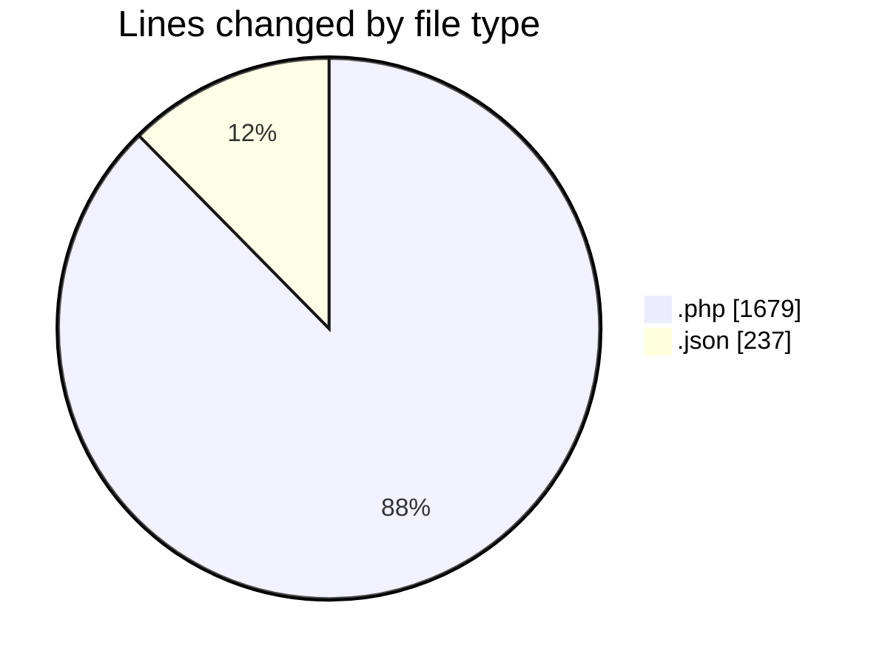
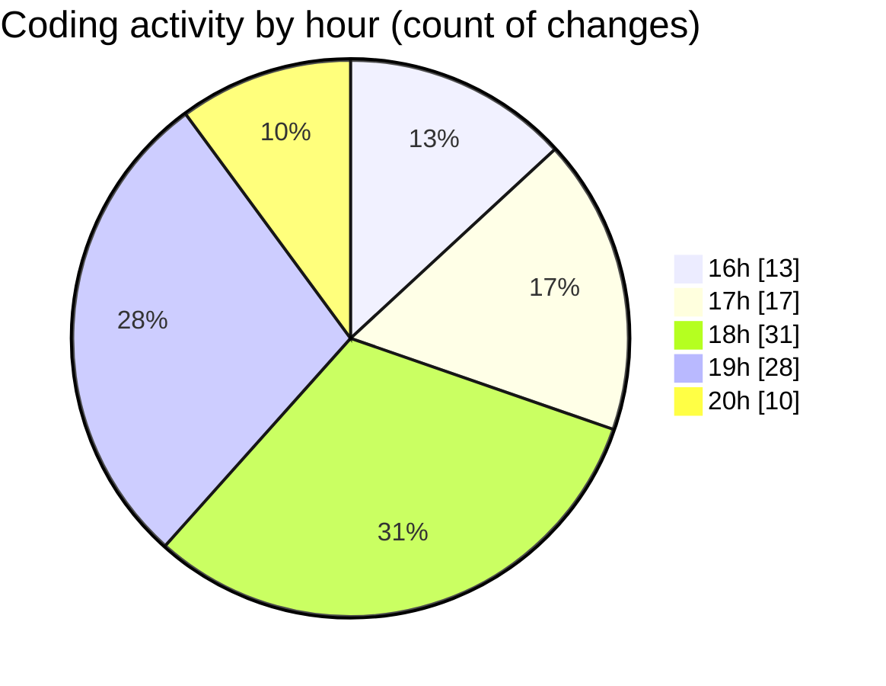

# studio-backend - Activity Summary 

## Overall Statistics

| Stat                   | Value                                                             |
| ---------------------- | ----------------------------------------------------------------- |
| **Lines Added** (➕)   | 1745                                          |
| **Lines Removed** (➖) | 171                                        |
| **Net Change** (↕)    | 1574                |
| **Active Time** (⌚)   | 132 minutes |

## Modified Files
- **UserController.php** (+180, -0)
- **web.php** (+103, -28)
- **index.blade.php** (+67, -0)
- **create.blade.php** (+47, -0)
- **edit.blade.php** (+48, -0)
- **sidebar.blade.php** (+71, -33)
- **0001_01_01_000000_create_users_table.php** (+140, -29)
- **AdminUserSeeder.php** (+22, -0)
- **DummyDataSeeder.php** (+25, -0)
- **DatabaseSeeder.php** (+24, -2)
- **RoleSeeder.php** (+37, -11)
- **Role.php** (+25, -0)
- **RoleMiddleware.php** (+38, -5)
- **Role.php** (+11, -0)
- **settings.json** (+237, -0)
- **app.php** (+22, -3)
- **dashboard.blade.php** (+56, -0)
- **User.php** (+67, -18)
- **AuthController.php** (+109, -0)
- **UserSeeder.php** (+25, -0)
- **DashboardController.php** (+23, -1)
- **index.blade.php** (+99, -1)
- **ProductController.php** (+90, -1)
- **select-for-booking.blade.php** (+21, -0)
- **BookingController.php** (+92, -0)
- **create.blade.php** (+66, -39)

## Visualizations

### By File Type (Lines Changed)

### By Hour (Estimated Activity Count)

> **Last Updated:** 5/28/2025, 8:15:14 PM