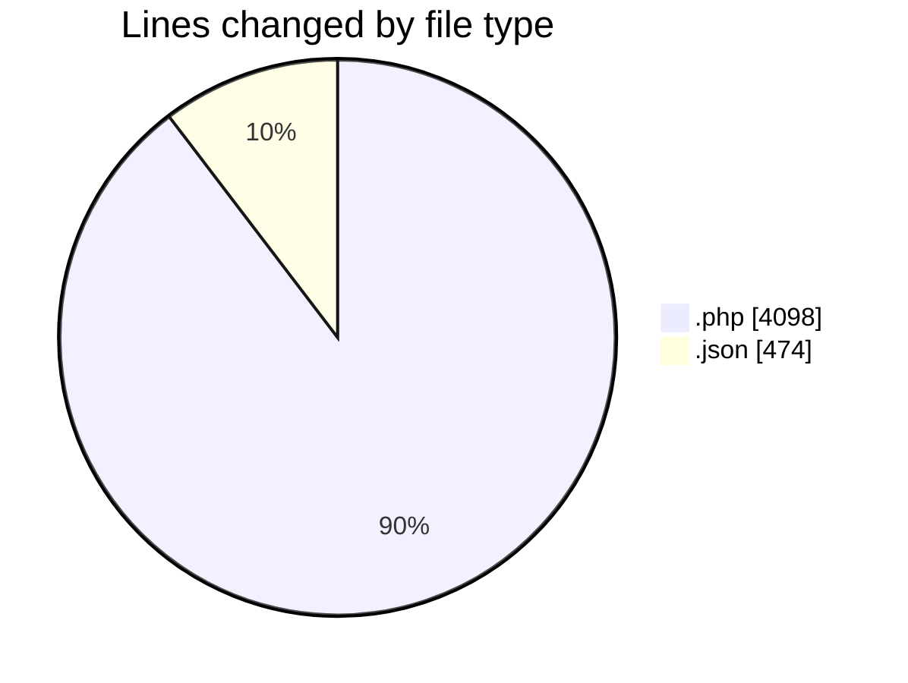
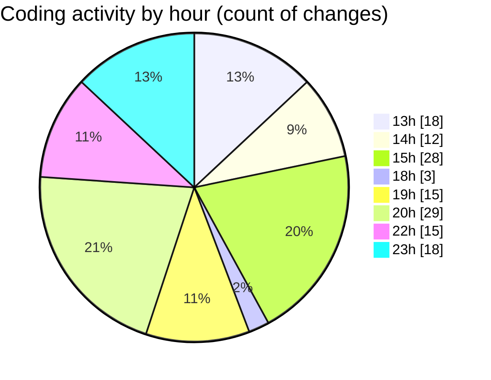

# studio-backend - Activity Summary 

## Overall Statistics

| Stat                   | Value                                                             |
| ---------------------- | ----------------------------------------------------------------- |
| **Lines Added** (➕)   | 4057                                          |
| **Lines Removed** (➖) | 515                                        |
| **Net Change** (↕)    | 3542                |
| **Active Time** (⌚)   | 240 minutes |

## Modified Files
- **sidebar.blade.php** (+181, -21)
- **index.blade.php** (+332, -12)
- **create.blade.php** (+719, -45)
- **settings.json** (+474, -0)
- **edit.blade.php** (+627, -11)
- **UserController.php** (+111, -7)
- **UserRequest.php** (+48, -0)
- **UserRequest.php** (+100, -0)
- **User.php** (+67, -13)
- **0001_01_01_000000_create_users_table.php** (+64, -1)
- **web.php** (+85, -0)
- **AuthController.php** (+167, -6)
- **UserSeeder.php** (+32, -0)
- **register.blade.php** (+162, -0)
- **UserResource.php** (+29, -0)
- **index.blade.php** (+215, -44)
- **create.blade.php** (+504, -322)
- **show.blade.php** (+140, -33)

## Visualizations

### By File Type (Lines Changed)

### By Hour (Estimated Activity Count)

> **Last Updated:** 6/16/2025, 11:38:51 PM