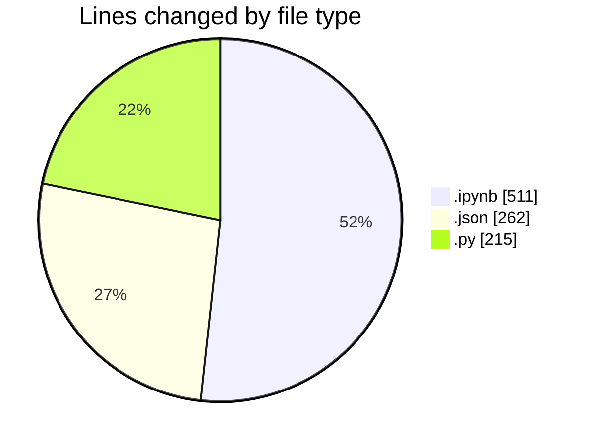
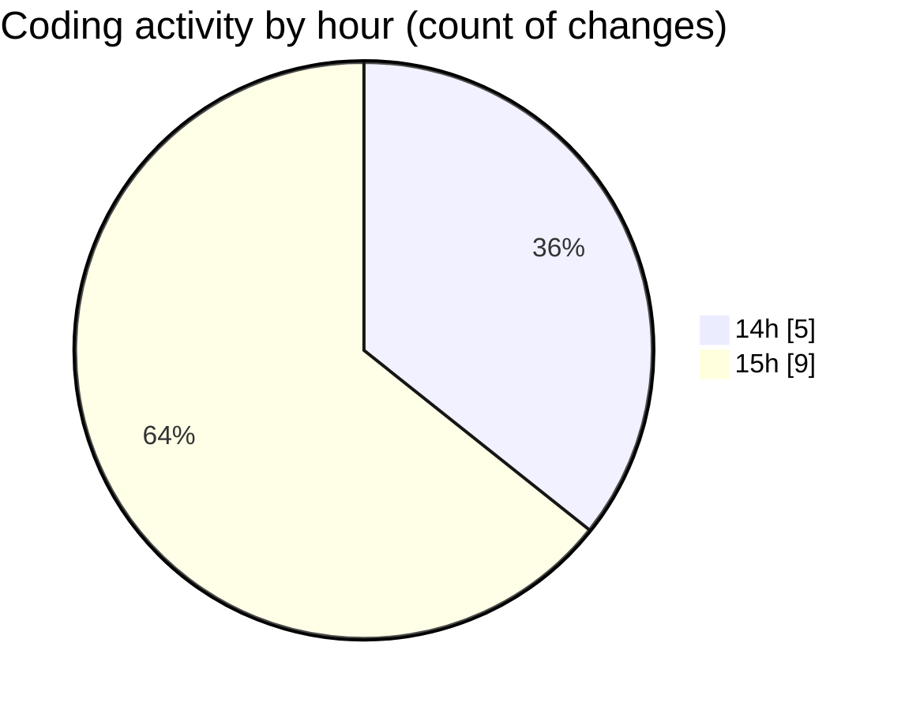

# mencoba - Activity Summary 

## Overall Statistics

| Stat                   | Value                                                             |
| ---------------------- | ----------------------------------------------------------------- |
| **Lines Added** (➕)   | 907                                          |
| **Lines Removed** (➖) | 81                                        |
| **Net Change** (↕)    | 826                |
| **Active Time** (⌚)   | 15 minutes |

## Modified Files
- **ujicoba.ipynb** (+430, -81)
- **settings.json** (+262, -0)
- **gui_defender2.py** (+108, -0)
- **gui_defender2.py** (+107, -0)

## Visualizations

### By File Type (Lines Changed)

### By Hour (Estimated Activity Count)

> **Last Updated:** 10/13/2025, 3:43:30 PM